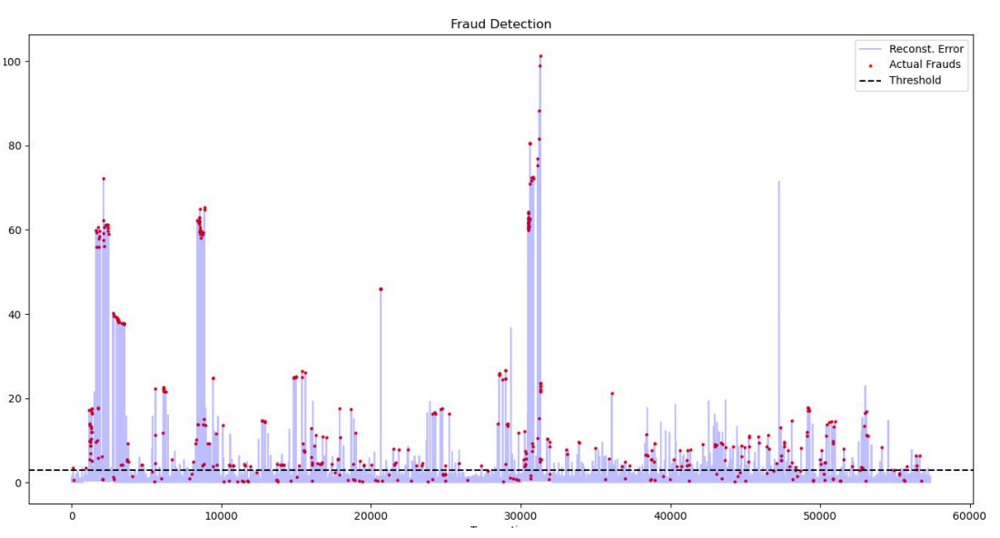

# Credit Card Fraud Detection with an Autoencoder

This project detects potentially fraudulent credit-card transactions using a custom **unsupervised Autoencoder** built with **PyTorch**.

The model is trained only on normal transactions. During testing, transactions that produce a high reconstruction error are classified as possible frauds.

## Overview

Credit-card fraud datasets are highly imbalanced, because fraudulent transactions represent only a very small percentage of all transactions. Instead of training a standard binary classifier, this project treats fraud detection as an **anomaly-detection problem**.

The main idea is:

1. Train the Autoencoder using only legitimate transactions.
2. Reconstruct the transactions through the network.
3. Calculate the reconstruction error for every test transaction.
4. Mark transactions with an error above a selected threshold as fraudulent.

## Dataset

The project uses the **Credit Card Fraud Detection** dataset from Kaggle:

https://www.kaggle.com/datasets/mlg-ulb/creditcardfraud

Download `creditcard.csv` and place it in the same directory as the Python script.

The dataset contains:

- `Time`: seconds elapsed between transactions.
- `V1`–`V28`: anonymized features produced using PCA.
- `Amount`: transaction amount.
- `Class`: transaction label:
  - `0` = legitimate transaction
  - `1` = fraudulent transaction

In this implementation, the `Time` column is removed and the `Amount` column is standardized.

## Model Architecture

The Autoencoder compresses each transaction into a four-dimensional latent representation and then reconstructs the original input.

```text
Input
  ↓
Linear(input_size → 16) + ReLU
  ↓
Linear(16 → 8) + ReLU
  ↓
Linear(8 → 4) + ReLU
  ↓
Linear(4 → 8) + ReLU
  ↓
Linear(8 → 16) + ReLU
  ↓
Linear(16 → input_size)
  ↓
Reconstructed transaction
```

For this dataset, the input contains 29 features after removing `Time` and `Class`.

## Data Preparation

The preprocessing pipeline performs the following steps:

- Removes the `Time` column.
- Standardizes the `Amount` column with `StandardScaler`.
- Selects 80% of legitimate transactions for training.
- Uses the remaining legitimate transactions and all fraudulent transactions for testing.
- Converts the NumPy arrays into PyTorch tensors.
- Loads the training data in batches of 256 transactions.

## Training

The model is trained with:

- Loss function: Mean Squared Error (`MSELoss`)
- Optimizer: Adam
- Learning rate: `0.001`
- Epochs: `15`
- Batch size: `256`

The script automatically uses CUDA when a compatible GPU is available. Otherwise, it runs on the CPU.

## Fraud-Detection Threshold

After reconstruction, the Mean Squared Error is calculated separately for every test transaction.
The threshold is defined as the 98.8th percentile of the reconstruction errors.
A transaction is classified as fraudulent when:

```text
reconstruction error > threshold
```

## Evaluation

The program calculates the following metrics for the fraud class:

- **Precision**: the proportion of predicted frauds that are actual frauds.
- **Recall**: the proportion of actual frauds that were detected.

The values are printed after the model finishes testing.

## Visualization

The generated plot displays:

- The reconstruction error for every test transaction.
- Actual fraudulent transactions as red points.
- The fraud-detection threshold as a dashed horizontal line.



Large reconstruction-error peaks usually indicate transactions that differ significantly from the legitimate transactions used during training.


## Usage

Make sure the project directory contains the dataset:

```text
creditcard-fraud-autoencoder/
├── fraud_AE.py
├── creditcard.csv
├── fraud_detection_plot.png
└── README.md
```

Run the program:

```bash
python fraud_AE.py
```

During execution, the script will:

1. Prepare the dataset.
2. Train the Autoencoder.
3. Calculate reconstruction errors.
4. classify suspicious transactions.
5. Print precision and recall.
6. Display the fraud-detection plot.

## Requirements

- Python 3.9 or newer
- pandas
- NumPy
- PyTorch
- Matplotlib
- scikit-learn

 Install the required packages:

```bash
pip install pandas numpy torch matplotlib scikit-learn
```


## Important Note

This project is intended for educational and experimental purposes. A real financial fraud-detection system would require stronger validation, continuous monitoring, explainability, secure data handling, and evaluation on changing transaction patterns.
